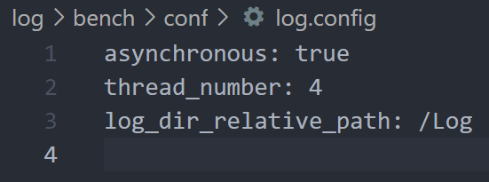
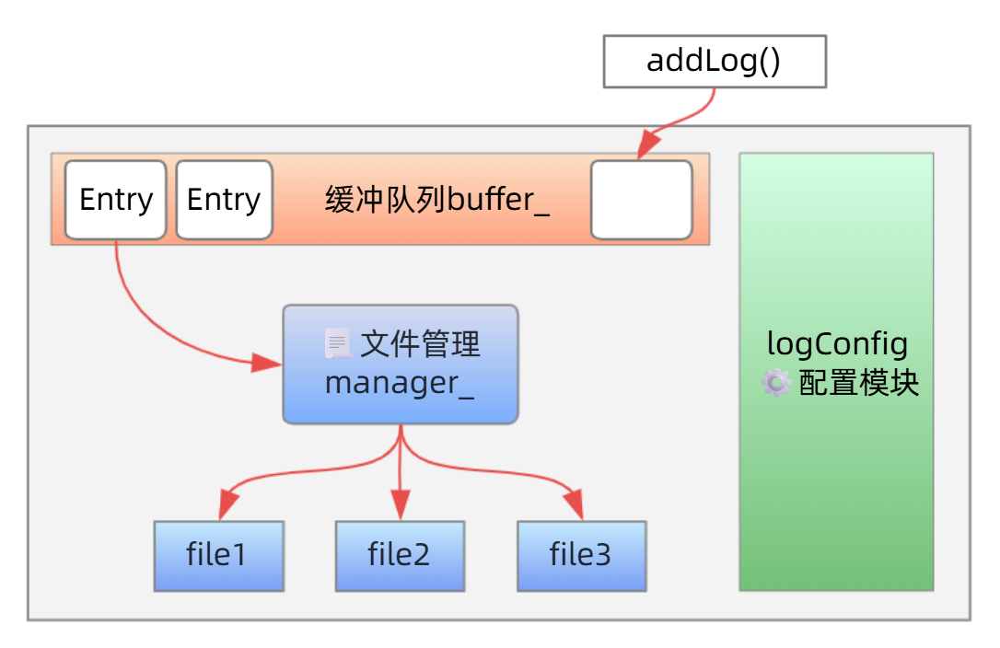

# Log

## 前言
<font color="red"><b>强烈建议在所有场景下使用std::string而不是C_str！！！极易导致空指针悬挂！！！除非由百分百的把握保证代码是正确的！！！</b></font>，我就因为这一个极难查找的空指针悬挂浪费了半天的时间😔😔😔

使用C++17进行编写：
- std::any
- std::filesystem

实际写起来其实没有想象中的简单，因为模块有点多，各个模块需要精心设计，同时，还需要注意线程安全。

因此，v1.0先实现基础目标，让log具有大致结构的同时，使其能够正确写入，此时先不考虑其I/O效率问题（实在没办法了，不过现在的效率也还过得去😔😔😔）

## Example
```cpp
Log& logger = Log::getInstance();
logger.addLog(LogLevel::Info, "Example module", "This is an example msg!!!");

logger.close(); // 只有close之后，缓冲区中的残留才会刷新
                // 并且多线程下需要使用close手动关闭线程池
```
使用`conf/log.config`对log配置进行修改：

👉 anynchronous: 是否异步写入

👉 thread_number: 线程个数

👉 log_dir_relative_path: 日志文件的存放路径（相对于工作路径）

## 设计目标
1. 可以进行异步写入
2. 可以选择是否使用缓冲区（使用缓冲区提高I/O效率，不适用缓冲区提高实时性）
3. 具有一个比较复杂、综合的算法来对Log进行写入：
    - 需要考虑日志信息的优先级（没做到😭😭😭）
    - 同时又不能太损失日志的实时性
4. 高度模块化设计（算是做到了，每个类的分工十分明确，并且目录结构十分清楚👼）
5. <font color="sky-blue">能自定义log文件格式（没做到，可能要去学一学编译原理相关的东西？🤔🤔🤔）</font>

## 架构设计


## 模块细分
1. logConfig: 用于信息配置，默认存储在conf/log.config文件中
2. logFromat: 用于对日志的输出信息进行格式化（一开始想设计一个能接收任意参数的，但是想了半天发现目前没必要）
3. logFileManager: 对日志文件进行管理，同时进行实际写入
4. logEntry: 用于创建实际的日志条目，使得缓冲区中的信息更好被管理
5. utils: 其中包含一些基础模块
    - timeStamp: 时间戳，获取当前的时间
    - logLevel: 日志等级划分
    - logQueue: 线程安全队列，作为缓冲区

## C++语法
### enum和enum class
`enum`是传统枚举，它的作用域是全局，因此很容易发生命名冲突等问题，并且它的成员能够隐式转换成`int`类型，安全性较差:
```cpp
enum Color {
    Red,
    Blue
};

int main() {
    int temp = Red; // 此处可以直接使用
}
```

`enum class`则是C++11引入的语法，它具有枚举类型作用域，必须使用类型名限定：
```cpp
enum class Color {
    Red,
    Blue
};

int main() {
    int temp = Color::Red; // 不能直接使用，需要使用限定符进行修饰
}
```
- `enum class`不容易出现命名冲突
- 它不能进行隐式转换，即使在声明的时候指定了其底层存储类型:
    ```cpp
    enum class Color : int {
        Red = 1, 
        Blue
    };

    int main() {
        int val = Color::Red; // 错误，不能隐式转换
    }
    ```

### 静态局部变量和静态成员函数
```cpp
void func() {
    static int value = 0;
    cout << value << endl;
    value++;
}
```
对局部变量使用`static`关键字，它具有以下特点：
1. 只被初始化一次，具有静态变量的特点
2. 作用域和局部变量一致，具有局部变量的特点

所以它天然就适用于实现**单例**。

## TimeStamp的线程安全问题
在一开始的`TimeStamp`中：
```cpp
class TimeStamp {
public:
    std::string TimeStamp::date() {
        auto now = std::chrono::system_clock::now();
        std::time_t t = std::chrono::system_clock::to_time_t(now);
        std::tm tm = *std::localtime(&t); // Dangerous!!!
    }
    ...(使用的local获取tm*)
}
```

但是这样在实际运行中，出现的bug那是千奇百怪：
现在是22号，但是在经过文件系统包装后，会出现21和23号的时间（日志文件创建是根据Entry的创建时间来的）。

<font color="red"><b>这是因为``loacltime``是线程不安全的，它的返回值是静态缓冲区的内存地址</b></font>，在多个线程同时调用的时候，这些线程会同时写入一个静态缓冲区，当A在读其中的数据时，B正好向其中写入，A读到的数据就可能是被B修改的或混乱的。

此时需要换用线程安全的``localtime``：
- Windows: ``localtime_r``
- Posix(Linux): ``localtime_s``

并且，``TimeStamp``它本身不存储任何的数据，所以将其功能函数声明为``static``是个好主意，这使它不用实例化就能使用。

## 严重问题
### timer
目前的`timer`的设计是有严重问题的,因为当前的timer是基于线程的,每创建一个定时器都会创建一个新的线程用于定时、回调等一系列操作,这在高并发的场景下是十分危险的,它很容易导致“==线程爆炸==”.
因此最好的方式应该是重新实现一种定时器,AI推荐了三种全新的定时算法:
1. 时间轮定时器
2. 红黑树定时器
3. 最小堆定时器

<font color="red">但是这两种定时器的原理我还没有搞清楚,后续再进行更新吧.</font>