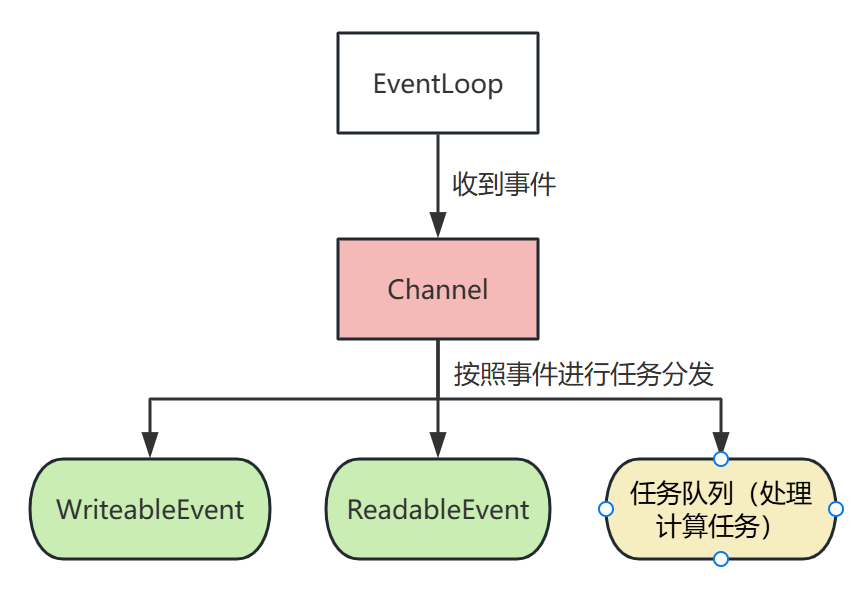

# 前言
我对于网络编程一直以来都是处于一知半解的状态，以至于当我想编写这个网络通讯模块的时候，我是抓瞎的😶，我不知道我要写什么功能，怎么写。
于是，我利用AI解决了我大部分的疑惑，并写下此篇笔记😭

# 网络通讯的流程
这里将TCP和UDP分开进行说明，同时分为服务端（Server）和客户端（Client）。

## TCP
- Server流程：
    1. 创建监听socket
    2. 使用bind将IP和端口等信息进行绑定
    3. 使用listen对backlog进行设置，初始化SYN和Accept队列，使socket进行被动监听状态
    4. 使用accept，从Accpet队列中取出一个已建立的连接，与客户端进行通信，返回的是一个文件描述符，借此来和client进行交流
    5. 使用send/recv与客户端进行通信
    6. 使用close关闭通信socket
    7. 使用close关闭监听socket

- Client流程：
    1. 创建通信socket
    2. 使用connect，触发TCP三次握手，建立TCP连接
        - 发送SYN -> 接收SYN+SCK -> 发送ACK
    3. 连接成功后，使用send/recv与服务端进行通信
    4. 使用close，触发四次挥手，释放连接资源
        - 发送FIN -> 接收ACK -> 发送FIN -> 接收ACK

## 内核细节说明
若是在写代码的时候会稍微思考一下，很容易就会产生疑惑：我们都知道三次握手四次挥手，但是其中的核心逻辑在内核中是如何实现的？大家也都知道调用SYS API，但是它们背后都做了些什么事？这都是我所好奇的。

### 连接是如何建立的？
首先，在服务端中，会先使用bind和listen使得至少一个文件描述符能够进入监听状态，监听设备的网络状态。在使用listen之后，内核会创建两个**队列**：SYN队列和ACK队列。

# Reactor
这是高性能服务器的常用设计模式，它的本质是一个**事件转发器**，是**事件驱动模型**的一种实现，是网络模块的核心中枢，负责将读写事件分发给别的线程处理。

> Reactor模式：
> 1. Reactor线程：处理来到服务器的各种事件，连接请求，读写事件等
> 2. Handles处理中心：非阻塞地执行业务逻辑

而通过对各个流程、逻辑的细分、优化，又可以引出多种线程模型：
1. 单线程模型（不提，基本不用，Handle和Reactor在一个线程中）
2. 多线程模型
3. 主从多线程模型

### 多线程模型
Reactor线程是一个单独的线程，用于处理连接、IO事件读取和事件分发。但由于它的任务太重了，很容易就达到瓶颈，于是就有了后来的主从多线程模型。

Worker专注于处理被分发的事件和进行实际的业务处理，一般会用线程池来实现。

### 主从多线程模型
在多线程模型中，由于单一的Reactor线程很容易达到瓶颈，于是Reactor也可以使用多线程：主Reactor专门进行连接建立，从Reactor线程专注于IO事件分发和事件读写。具体如下：
==主Reactor可以接收连接，然后将连接的fd注册到从Reactor中进行实际的事件监听（事件监听相比接收新连接更耗时间）==，然后由从Reactor负责IO数据的接收和发送，实际的业务逻辑处理还是由Workerr完成。

## 阻塞IO和非阻塞IO
首先说说阻塞IO的缺点在哪？TCP的三次握手建立起来之后，往往网卡（也就是listenfd）上的数据不是立即到达的，因此，需要等待一段时间，而此时便会阻塞等待，这就导致了CPU性能的浪费。
而若是使用的非阻塞IO，若是当前的fd中，等待的数据还没准备好，它不会阻塞等待，而是会直接返回，此时就可以去处理其它的逻辑，更好的利用了CPU资源，但是这样又引发了新的问题：对于IO的处理逻辑会更为复杂。因为需要一次性将可读的数据完全处理完毕才行。

### 非阻塞IO细项（待补充）
在非阻塞IO中，有很多需要的注意事项，因为它不阻塞，所以程序需要使用轮询的方式来进行事件处理，因此，不同的返回值和`errno`的组合需要如何处理都是很关键的。

非阻塞的一个好处就是它不阻塞，CPU可以花更多时间在处理其它业务上，这就提升了系统的并发能力。

## Reactor的实现
### EventLoop
`EventLoop`是整个模块的核心，它用于建立TCP连接和进行任务分发，它和IO多路复用模型紧密关联，在本项目中使用的`epoll`，在大多数的项目中也使用的是`epoll`。

### Channel(多线程下)
`Channel`的意思是**管道**，这个名字其实还蛮贴切的，因为它负责将要处理的事件进行实际的分发操作：

分发后，每种事件的实际处理可能有一个或者多个线程（**这个线程管理的能力是Reactor架构提供的，而不是由Channel提供的，Channel只进行`事件->回调函数`的转换**），这样就将各个线程要做的事件进行了细分，能更好的利用CPU的多核能力，并且降低`EventLoop`的压力。

`Channel`负责事件转换，搭配`EventLoop`进行使用，实现按照到达系统的事件进行任务分发。==它封装了一个文件描述符及其感兴趣的事件，并将所有感兴趣的事件与用户指定的回调函数进行绑定==。

在通过`epoll_wait`获得触发的事件列表后，各个有事件到来的文件描述符所拥有的状态都在数组`EventLoop::events_`中，这个数组的数据类型是`epoll_event`其中记录了被触发的fd等数据结构，因此，可以通过查询其对应的`Channel`来查找对应事件的回调函数，然后进行实际的处理。

`epoll_event`及其相关的数据结构的声明如下：
```cpp
typedef union epoll_data // 注意这里是union，所以每次只能够使用其中的一个字段
{
  void *ptr; // 指向一个内存缓冲区
  int fd; // 文件描述符
  uint32_t u32;
  uint64_t u64;
} epoll_data_t;

struct epoll_event
{
  uint32_t events;	/* Epoll events */ // 用户设置的关心的EPOLL事件
  epoll_data_t data;	/* User data variable */
} ;
```
`epoll_event.data`中的字段的作用都是什么，这其实就需要先了解`epoll`的原理了，这些内容在后面的篇幅会说。


#### Epoll
首先，使用`epoll_create`创建一个对象，这个对象是被维护在内核中的，用户几乎是不可见的，我们唯一可以做的就是通过该函数返回的文件描述符来操控epoll。

然后通过`epoll_ctl`，对epoll的文件描述符进行操控，以此来设置epoll想要关注的事件，添加epoll监控的文件描述符也是通过`epoll_ctl`进行设置。

最后，使用`epoll_wait`阻塞等待或者非阻塞等待内核通知事件处理。若是epoll设置为非阻塞IO，此时`epoll_wait`不会阻塞等待事件到来，而是会直接返回，正是因此，我们在处理IO逻辑的时候会更加复杂一点，因为若是在处理数据的过程中，系统有一个中断请求到来，我们对数据的处理就会不完全，因此需要考虑到这一部分，当然，这是后话了。

在进行`epoll_ctl`的时候，就会设置上述提到的结构体`epoll_event`，我们在其中设置`epoll_event.data.fd`为我们想要监控的那个文件描述符，然后`epoll_event.events`则是要监控的、发生在该文件描述符上的事件。

内核中只是按照我们的要求对事件进行监控，内核不会对这些数据结构进行更改操作，这一点应该要记住。那么，在什么情况下才会使用到`epoll_data`中的其它字段呢？

例如`ptr`字段，它是`void*`类型的，这就意味着它能够指向各种指针，比较常用的一点就是指向一个更为复杂的、可以是用户自定义的数据结构，可以利用这一个字段，来或许更多我们需要的信息。

而`epoll_ctl`告诉epoll到底要监听的是哪个文件描述符，实际上是通过epoll_ctl的第三个参数指定的，而和`epoll_event`无关：
```cpp
epoll_event ev{};
ev.events = events; // 设置用户关心的，来到文件描述符fd的事件
ev.data.fd = fd; // 仅仅是一个最简单的标记，若是同时还关心其它的数据，应该使用ptr字段，而不是fd字段

// 其中的fd字段才真正指定了epoll关心的是哪个文件描述符，而和epoll_event中的fd字段无关，后者是可以任意进行设置的
if (epoll_ctl(epoll_fd_, EPOLL_CTL_ADD, fd, &ev) < 0) {
    return false;
}
```

最后，由于操作`epoll`是通过文件描述符进行操作的，只需要使用`close`关闭这个epoll的句柄，就等于释放了epoll所占用的资源，但是，它所监控的文件描述符是不会因此自动关闭的，因此，这里还需要我们手动地进行资源释放。

#### Epoll原理详解
#### Epoll的ET/LT模式
#### 使用epoll_event.epoll_data.ptr字段
---
回到Reactor的实现中，