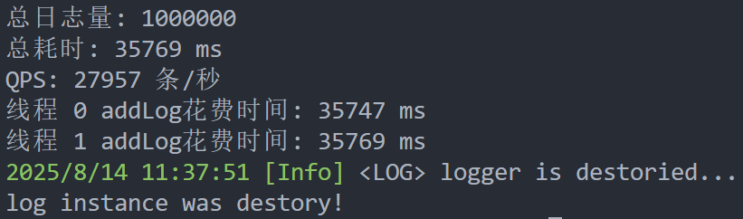
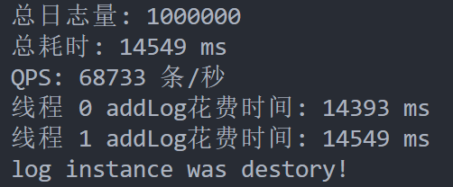
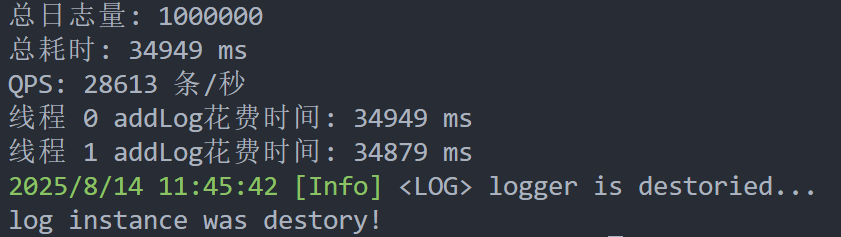
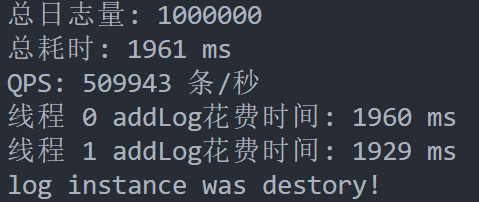
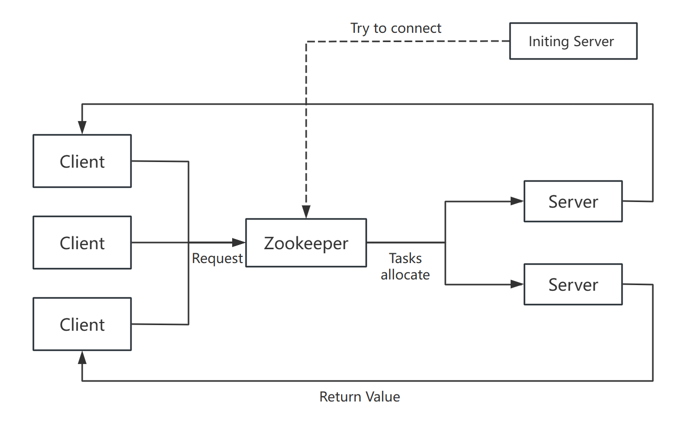

## 📃任务清单
<font color="red"><b>点击链接跳转查看[TODO List](TODO.md)！！！欢迎issue和pr！！！</b></font>😆😆😆

## 大纲

👉 [简介](#modules)

👉 [Building]()

👉 [Tutorials](#tutorial)

👉 [线程池ThreadPool](#threadpool)

👉 [日志Log](#log)

## 🏅项目简介

## Building
本项目开发时使用`Ubuntu 22.04`操作系统，其它OS运行情况未知，欢迎反馈😄😄😄！！！

首先，将项目`clone`至本地：
```shell
git clone https://github.com/WhiteFMoShi/MoShiRPC
```

若是希望单独构建开发环境，而不进行其它操作：
```shell
cd MoShiRPC
make third_patry
```

这将会自动编译第三方依赖，但不会将依赖库放于合适位置，建议运行：
```shell
make build
```

这将为您处理依赖库的同时，于`build/bin`中生成项目可执行文件。

## 📕Previous Tutorials
#### Tools Tutorials
[CMake官方教程](https://cmake-doc.readthedocs.io/zh-cn/latest/guide/tutorial/index.html)

[Makefile快速教程](https://makefiletutorial.com/#getting-started)

[git commits](https://www.conventionalcommits.org/zh-hans/v1.0.0/)

[Doxygen注释风格](https://doxygen.cpp.org.cn/manual/docblocks.html)

#### Coding Tutorials
[C++ 网络编程]()

[muduo]()

## 📂模块详细说明

### third_party
<font color="red"><b>所有外部库文件的下载、编译无需手动，在项目根目录下执行`make third_party`即可。</b></font>

使用[cJson](https://github.com/DaveGamble/cJSON)库作为本项目的Json生成、解析，`construction.sh`会完成自动的下载、编译操作。

### Log
一个高效、文件配置、简单易用的[日志](Note/日志模块.md)（预期使用Json对类行为进行配置）。

#### 🫡模块优势
1. 较快的写入速度
2. 统一的使用接口
3. 文件句柄自动管理，可长期运行
4. 文件配置日志行为

#### 💡Log架构设计


#### 🚀性能测试
测试代码：[bench](log/bench/bench.cpp)，但是在我主机上测不太出🤣

在2生产者、每个生产者生成500k日志的情况下：
1. 单线程+终端输出：


2. 仅单线程：


3. 2线程+终端输出：


4. 仅2线程：


可以看到，**在本人主机上，addLog的写入速度是瓶颈，文件的写入速度明显是快于此的**。

### RPC
本项目核心组件

#### 💡RPC架构设计
