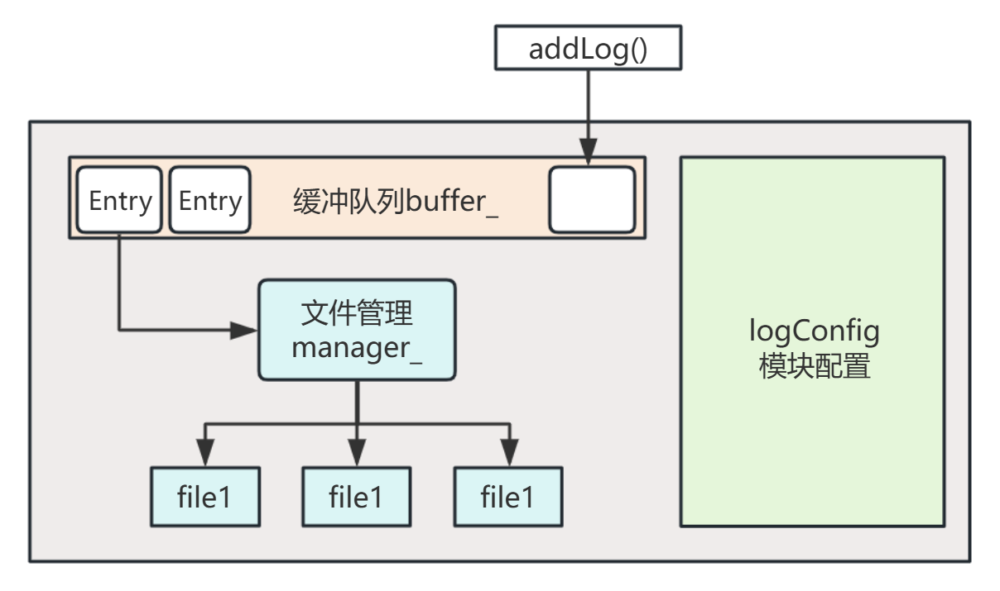
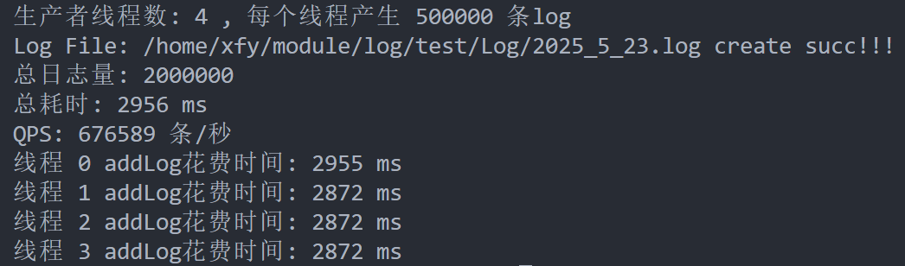
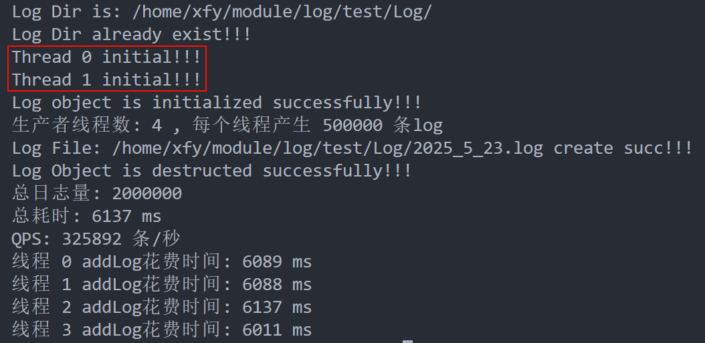

# 大纲
👉 [简介](#modules)

👉 [线程池ThreadPool](#threadpool)

👉 [日志Log](#log)

# Modules目录
## ThreadPool
[线程池](./Note/线程池.md)组件，其中包含两个重要模块：
- 安全的任务队列（可以更改为无锁队列的版本）
- 线程池本体

实现起来的难度不高，但是很实用。

## Log
一个高效、简单易用的[日志类](./Note/日志模块.md)

### Log架构设计

### 性能测试
测试代码：[bench](./log/bench/)，实际上我觉得测不太出🤣

|写入方式|QPS|
|:-:|:-:|
|同步写入|676,589条/秒|
|异步写入(2线程)|325892条/秒|

1. 同步写入测试（单线程）：

2. 异步写入测试（2线程）：

在线程同步上的开销还是有点大，我试图更换无锁队列，实际上速度没有什么改变，我的瓶颈应该是在线程同步中。